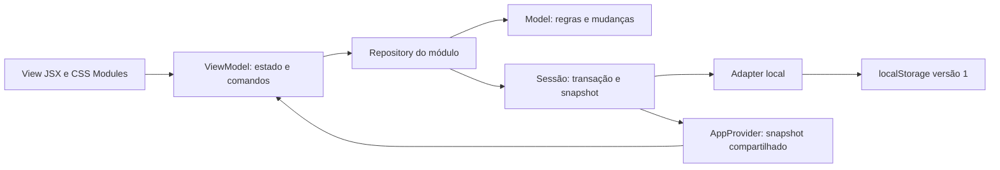

# Arquitetura do frontend

Decisão de destino confirmada: React + Vite + JavaScript/JSX + CSS Modules + MVVM. Estado da implementação e verificações: [plano de execução](../../0_Context/c_delivery/dental_flow_ap_clinic_SPC_frontend_refactor.md).

## Responsabilidades

| Parte | Responsabilidade | Dependências permitidas |
| --- | --- | --- |
| View (`.jsx`) | Renderização, semântica, foco, controles e composição visual | ViewModel, componentes, CSS Modules, formatadores e metadados do Model |
| ViewModel (`.js`) | Rascunho, filtros, estado de envio, erro, comandos e contexto da rota | React, router, Repository, regras/formatadores |
| Model (`.js`) | Dados e regras do domínio | Funções JavaScript; nenhuma dependência de React, DOM ou armazenamento |
| Repository (`.js`) | Consultas e operações, aplicação de regras dentro da transação | Model e sessão de dados injetada |
| Sessão de dados | Snapshot compartilhado, trava de gravação, auditoria e publicação do novo estado | Adapter de armazenamento, provedor React como ligação com a interface |
| Adapter local | Leitura, compatibilidade e gravação do snapshot | Armazenamento injetado, cenário inicial |

ViewModels são hooks próprios. Isso não cria compartilhamento automático de estado entre chamadas: o provedor mantém o snapshot central e os rascunhos permanecem locais a cada tela.

Repository recebe a sessão por injeção. Model retorna a mudança; a sessão grava antes de publicar. Não há chamadas de API neste diagrama.

## Estrutura e migração

Cada módulo migrado usa `feature/<module>/{model,repository,view_model,view}`. Compartilhados ficam em `component`, `app`, `data/local` e `style`. Dados fictícios e controles de simulação continuam identificados como demonstração.

A separação foi aplicada aos módulos existentes: Pacientes, Doutores, Estoque, Orçamentos/odontograma, Agenda, Caixa, Administração, Acesso, Painel e Revisão. A fachada `useDemo` e o store original foram removidos. Sete módulos com operações persistidas possuem Repository; Acesso usa simulação transitória, Painel agrega dados existentes e Revisão controla a sessão, sem Repositories vazios.

No odontograma e nos gráficos, estado visual e geometria permanecem na apresentação. Valores de itens, escolha de procedimento, filtros, intervalos e agregações da rotina ficam nos Models/ViewModels. Foco e confirmação são aplicados pela View a partir dos comandos e resultados do ViewModel.

A atualização visual da Agenda usa `model/calendar_model.js` para recortar intervalos por dia, distribuir sobreposições em colunas e gerar semanas completas do mês. Essas projeções puras conservam a identidade dos registros e não persistem dados. O ViewModel aplica período/filtro e prepara segmentos, contagens e contexto de navegação. A View transforma minutos em posições/dimensões CSS e controla a rolagem inicial e o foco. A escala de 24 horas não representa uma regra de expediente. [Decisão e evidências da versão A](../../0_Context/c_delivery/dental_flow_ap_clinic_SPC_frontend_visual_update.md).

ESLint proíbe React/DOM/persistência nos Models, DOM/CSS/Views nos ViewModels, React/Views/ViewModels nos Repositories e acesso direto a provider/Repository/armazenamento nas Views. Reset, fonte e tokens continuam globais; estilos dos componentes e telas usam CSS Modules.

## Garantias dos dados

- A chave permanece `dental_flow_demo_v1` e a versão permanece 1 enquanto o formato persistido não mudar.
- Leitura compatível adiciona apenas os campos ausentes previstos e mantém as transformações já existentes do cenário inicial.
- Um snapshot ilegível não é sobrescrito silenciosamente; a recuperação exige a ação de restauração existente.
- Gravação bloqueia operações simultâneas nesta sessão. Isso não representa controle de concorrência entre abas ou servidor.
- O snapshot só é publicado no React depois de uma gravação bem-sucedida.
- Registro, histórico e auditoria são persistidos juntos. IDs, códigos e referências são preservados.
- Saída de estoque verifica novamente o saldo atual dentro da operação antes de persistir.
- Dinheiro continua representado em centavos; a refatoração não muda arredondamento ou políticas comerciais.

## Interface e acesso

Manter hash routes, filtros na URL, `/painel` e o alias `/dashboard`, incluindo busca/data. CSS Modules organiza os estilos dos componentes e telas; a versão A atualiza seus tokens e superfícies. Os efeitos de foco e diálogos pertencem à apresentação.

Login/Cadastro continuam demonstrativos. Senhas permanecem apenas no estado transitório do formulário e não são persistidas ou registradas em logs. A separação arquitetural não implementa autorização real.

Seleção de cadastros usa o componente compartilhado `component/record_picker.jsx`, funções puras em `record_search.js` e estado/comandos em `use_record_picker.js`. Os módulos fornecem coleções e `onChange` pelos ViewModels. O componente não lê dados do provider/Repository nem grava snapshots; mostra até oito resultados por página da consulta em memória. O dialog e foco pertencem à apresentação, em portal fora do formulário externo. [Escopo/evidências da busca](../../0_Context/c_delivery/dental_flow_ap_clinic_SPC_frontend_record_selection.md).

## Verificação

[Estratégia e critérios de aceite](../d_quality/dental_flow_ap_clinic_SPC_frontend_refactor_validation.md). Regras de domínio devem poder ser testadas sem navegador. Comportamentos de ViewModel e View são verificados pelos fluxos Playwright existentes e pelas regressões específicas acrescentadas quando houver risco.

## Paginação de todas as listagens

O hook compartilhado de paginação mantém estado/contexto; o componente de apresentação recorta somente os registros visíveis. Filtros, regras, totais, snapshot e gravações continuam nas camadas existentes. Não há API ou migração de dados. [Escopo e evidência](../../0_Context/c_delivery/dental_flow_ap_clinic_SPC_frontend_pagination.md).
