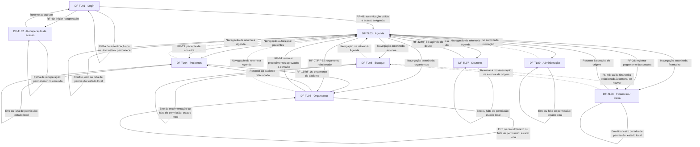

# Dental Flow

> Atualização técnica de 06/10/2026: o usuário confirmou React + Vite + JavaScript/JSX + CSS Modules + MVVM. A migração está registrada no [plano de execução](../../0_Context/c_delivery/dental_flow_ap_clinic_SPC_frontend_refactor.md) e na [arquitetura](../b_technical/dental_flow_ap_clinic_SPC_frontend_architecture.md). Isso não altera o status de aprovação dos requisitos clínicos ou dos exemplos abaixo. A interface existente usa IBM Plex Sans; as referências originais a Inter são mantidas como origem da proposta, não como fonte aplicada no frontend atual.

## 1. Visão Geral

Dental Flow é um projeto acadêmico de sistema de gestão para uma clínica odontológica, com foco em orçamento e gestão de estoque, conforme a definição do solicitante. O documento v1 também descreve agenda, pacientes, doutores, financeiro, administração, autenticação e recuperação de acesso. A proposta funcional é relacionar esses módulos, reduzir o recadastro de informações e preservar o histórico clínico, financeiro e administrativo.

O público operacional citado no v1 inclui usuários administrativos, recepção, financeiro e doutores; as personas e a matriz definitiva de permissões ainda não foram preenchidas. A plataforma de trabalho adotada é web responsiva, com front-end React + Vite e back-end Java + Spring Boot. O dispositivo físico de referência não foi informado; as larguras de avaliação são as solicitadas: 360, 768, 1024 e 1440 px.

O destino é Figma por importação de Markdown ou Google Stitch, ainda sem escolha entre eles. Esta especificação consolida os requisitos do v1 e a marca anexada. Tokens e layouts derivados estão identificados; não há wireframes nem copy final de produto disponíveis. Os registros de exemplo da planilha não constituem requisitos aprovados.

## 2. Personas e Implicações de Design

A aba Persona não contém personas preenchidas. Os resumos abaixo representam os perfis de acesso apresentados como exemplos no RF-44 do v1; não acrescentam idade, rotina, dor, dispositivo ou familiaridade digital. As implicações derivam das tarefas descritas e dependem da definição das permissões.

### Administrador — perfil de referência do v1

Função: administrar usuários, acesso e configurações do sistema.  
Atividades: cadastro de usuários, configuração de permissões, bloqueio e reativação.  
Dores, contexto de uso, dispositivo e necessidades individuais de acessibilidade: não informados.

**Implicações de design**

- RF-43 a RF-46 → apresentar cadastro, status e perfil de acesso de forma explícita no módulo de Administração.
- RF-44 → diferenciar visualização, criação, alteração e exclusão na edição de permissões; a estrutura final depende da matriz de acesso.
- RF-47 e RN-04 → disponibilizar os registros de auditoria no contexto administrativo, sem criar um módulo adicional.
- Necessidades individuais não informadas → aplicar a base de acessibilidade da seção 8 a todos os controles.

### Recepção — perfil de referência do v1

Função: operar pacientes, agenda, consultas, orçamentos e pagamentos no exemplo de RF-44.  
Atividades: cadastrar consultas, verificar conflitos e consultar o histórico do paciente.  
Dores, volume de atendimento, familiaridade digital e dispositivo: não informados.

**Implicações de design**

- RF-01 e RF-05 → priorizar agenda semanal e acesso à ação “Nova consulta”.
- RF-06 → apresentar o conflito junto aos campos de doutor, data, horário e duração, preservando os dados do formulário.
- RF-13, RF-16 e RF-52 → manter paciente e orçamento identificáveis ao alternar entre seus registros.
- Acesso a estoque ausente no exemplo de RF-44 → não atribuir essa permissão à recepção por inferência.

### Financeiro — perfil de referência do v1

Função: operar caixa, pagamentos e relatórios financeiros no exemplo de RF-44.  
Atividades: consultar movimentações, valores recebidos, previstos e em aberto.  
Dores, conhecimentos financeiros específicos, dispositivo e necessidades individuais: não informados.

**Implicações de design**

- RF-35 → separar entradas, saídas, saldo, contas pendentes, valores recebidos e valores previstos.
- RN-01 → manter orçamento, cobrança e pagamento distinguíveis, sem apresentar orçamento aprovado como valor recebido.
- RF-41 e RF-42 → manter filtros próximos aos resultados e indicar a origem dos valores apresentados.
- RN-03 → diferenciar saída financeira e entrada de estoque mesmo quando relacionadas à mesma compra.

### Doutor — perfil de referência do v1

Função: atender pacientes e operar agenda própria, orçamentos e procedimentos no exemplo de RF-44.  
Atividades: consultar atendimentos, configurar disponibilidade e relacionar procedimentos aos dentes.  
Dores, condições físicas de uso, familiaridade digital e dispositivo: não informados.

**Implicações de design**

- RF-18 → oferecer seleção do dente e da superfície por teclado, com identificação textual equivalente ao odontograma.
- RF-32 → manter disponibilidade do profissional identificada no contexto da agenda.
- RF-24 e RN-01 → distinguir procedimentos planejados de realizados.
- RF-44 e RF-46 → aplicar o escopo de acesso autorizado pelo back-end; o exemplo de agenda própria não define sozinho a política completa.

## 3. Design Tokens

Todos os tokens desta seção são uma base proposta, marcada como **(derivado)**. A planilha não possui uma paleta preenchida. As cores foram extraídas dos pixels mais frequentes do logotipo: azul muito escuro, turquesa, verde azulado e branco. Como a imagem contém pequenas variações de fundo, a extração não equivale a um manual oficial da marca.

Contrastes calculados pela luminância relativa sRGB. AA para texto normal exige pelo menos 4,5:1; texto grande e elementos gráficos essenciais exigem pelo menos 3:1. O tamanho de referência para conversão é o token fonte-base, sem impedir o ajuste de fonte pelo usuário.

### Cores

| Token | HEX | RGB | Papel | Onde é usada | Cor do texto sobre ela | Contraste | WCAG AA |
| --- | --- | --- | --- | --- | --- | --- | --- |
| cor-fundo (derivado) | #01101F | 1, 16, 31 | Fundo da marca | Cabeçalho e navegação | cor-texto-inverso | 19,17:1 | Sim, texto normal |
| cor-superficie (derivado) | #FFFFFF | 255, 255, 255 | Área de trabalho | Formulários, listas, cards e modais | cor-texto | 19,17:1 | Sim, texto normal |
| cor-primaria (derivado) | #1ED8CF | 30, 216, 207 | Destaque principal | Ação primária e seleção sobre cor-fundo | cor-texto | 10,75:1 | Sim, texto normal |
| cor-secundaria (derivado) | #1C7675 | 28, 118, 117 | Ação secundária | Botão secundário | cor-texto-inverso | 5,39:1 | Sim, texto normal |
| cor-texto (derivado) | #01101F | 1, 16, 31 | Texto principal | Conteúdo sobre cor-superficie e cor-primaria | Não aplicável | 19,17:1 / 10,75:1 | Sim nos dois fundos |
| cor-texto-inverso (derivado) | #FFFFFF | 255, 255, 255 | Texto em fundo escuro | cor-fundo e cor-secundaria | Não aplicável | 19,17:1 / 5,39:1 | Sim nos dois fundos |
| cor-texto-secundario (derivado) | #1C7675 | 28, 118, 117 | Texto de apoio | Ajuda e metadados sobre cor-superficie | Não aplicável | 5,39:1 | Sim, texto normal |
| cor-borda (derivado) | #1C7675 | 28, 118, 117 | Limite de controles | Campos e limite de botão primário em superfície branca | Não aplicável | 5,39:1 sobre cor-superficie; 3,02:1 sobre cor-primaria | Sim para limite gráfico essencial |
| cor-foco-claro (derivado) | #01101F | 1, 16, 31 | Foco em superfície clara | Contorno externo sobre cor-superficie | Não aplicável | 19,17:1 | Sim para indicador de foco |
| cor-foco-escuro (derivado) | #1ED8CF | 30, 216, 207 | Foco em superfície escura | Contorno externo sobre cor-fundo | Não aplicável | 10,75:1 | Sim para indicador de foco |

**Restrições de uso**

- cor-texto-inverso sobre cor-primaria produz 1,78:1 e não atende AA; o botão primário usa cor-texto.
- cor-texto-secundario sobre cor-fundo produz 3,56:1 e não atende AA para texto normal.
- cor-primaria sobre cor-superficie produz 1,78:1; não usar como texto, contorno de foco ou único limite visual de controle nesse fundo.
- O botão primário sobre cor-superficie recebe cor-borda para tornar seu limite distinguível.
- Sucesso, erro, alerta e status de negócio ainda não possuem cores semânticas aprovadas. Na base proposta, sua informação é textual, com cor-texto sobre cor-superficie; a cor nunca identifica sozinha o estado.

### Tipografia

A referência de origem em Paleta de Cores, linha 46, cita H1 em Inter, peso 700, tamanho 32 e altura de linha 1,2, com um H1 por tela. O frontend atual adotou IBM Plex Sans; a tabela abaixo usa essa família e conserva os demais valores derivados da referência, sem inferir a fonte do logotipo. A conferência integral dos valores de layout com os tokens atuais continua pendente.

| Elemento / token | Fonte | Peso | Tamanho (px e rem) | Altura de linha | Uso |
| --- | --- | --- | --- | --- | --- |
| fonte-base (derivado) | IBM Plex Sans; fallback sans-serif | 400 | 16 px / 1 rem | 1,5 / 24 px | Base de leitura e conversão |
| texto-h1 (derivado) | IBM Plex Sans; fallback sans-serif | 700 | 32 px / 2 rem | 1,2 / 38,4 px | Um título principal por tela |
| texto-h2 (derivado) | IBM Plex Sans; fallback sans-serif | 700 | 24 px / 1,5 rem | 1,25 / 30 px | Seções principais |
| texto-h3 (derivado) | IBM Plex Sans; fallback sans-serif | 600 | 20 px / 1,25 rem | 1,4 / 28 px | Grupos de campos e painéis |
| texto-corpo (derivado) | IBM Plex Sans; fallback sans-serif | 400 | 16 px / 1 rem | 1,5 / 24 px | Conteúdo, campos e tabelas |
| texto-rotulo (derivado) | IBM Plex Sans; fallback sans-serif | 600 | 16 px / 1 rem | 1,5 / 24 px | Rótulos de formulário |
| texto-botao (derivado) | IBM Plex Sans; fallback sans-serif | 600 | 16 px / 1 rem | 1,5 / 24 px | Ações |
| texto-ajuda (derivado) | IBM Plex Sans; fallback sans-serif | 400 | 14 px / 0,875 rem | 1,5 / 21 px | Ajuda e metadados |
| texto-valor (derivado) | IBM Plex Sans; fallback sans-serif | 700 | 24 px / 1,5 rem | 1,25 / 30 px | Totais e indicadores financeiros |

### Espaçamento

Escala derivada de quatro unidades de pixel. Os valores aparecem apenas nesta definição; componentes e telas referenciam os nomes.

| Token | Valor | Uso |
| --- | --- | --- |
| espaco-4 (derivado) | 4 px / 0,25 rem | Separação curta entre partes de um controle |
| espaco-8 (derivado) | 8 px / 0,5 rem | Rótulo, campo, ajuda e ações compactas |
| espaco-12 (derivado) | 12 px / 0,75 rem | Padding de controles |
| espaco-16 (derivado) | 16 px / 1 rem | Margem mobile e intervalo entre campos |
| espaco-24 (derivado) | 24 px / 1,5 rem | Padding de painéis e separação de grupos |
| espaco-32 (derivado) | 32 px / 2 rem | Margem desktop e separação entre seções |
| espaco-48 (derivado) | 48 px / 3 rem | Separação ampla de blocos |
| espaco-64 (derivado) | 64 px / 4 rem | Referência dimensional do cabeçalho |

### Raio de borda e sombras

| Token | Valor | Uso |
| --- | --- | --- |
| raio-4 (derivado) | 4 px / 0,25 rem | Marcador de status e pequenos elementos |
| raio-8 (derivado) | 8 px / 0,5 rem | Botões, campos e cards de consulta |
| raio-12 (derivado) | 12 px / 0,75 rem | Painéis e modal |
| sombra-0 (derivado) | none | Conteúdo apoiado em superfície contínua |
| sombra-1 (derivado) | 0 4px 12px rgba(1, 16, 31, 0.12) | Modal e painel elevado |

### Dimensões, grid e foco

| Token | Valor | Uso |
| --- | --- | --- |
| toque-minimo (derivado) | 44 px / 2,75 rem em ambos os eixos | Área de acionamento mínima exigida no pedido |
| controle-altura (derivado) | Mínimo 48 px / 3 rem | Campo, select e botão padrão |
| borda-controle (derivado) | 1 px | Limites de campos e botões |
| foco-espessura (derivado) | 2 px | Contorno de foco |
| foco-afastamento (derivado) | 2 px | Distância entre controle e contorno |
| largura-conteudo (derivado) | Máximo 1280 px / 80 rem | Conteúdo central em viewport largo |
| largura-autenticacao (derivado) | Máximo 448 px / 28 rem | Painel de autenticação e recuperação |
| largura-navegacao (derivado) | 240 px / 15 rem | Navegação lateral desktop |
| altura-cabecalho (derivado) | Mínimo 64 px / 4 rem | Cabeçalho do shell |
| breakpoint-360 (derivado) | 360 px / 22,5 rem | Base mobile solicitada |
| breakpoint-768 (derivado) | 768 px / 48 rem | Tablet solicitado |
| breakpoint-1024 (derivado) | 1024 px / 64 rem | Desktop solicitado |
| breakpoint-1440 (derivado) | 1440 px / 90 rem | Desktop largo solicitado |
| grid-mobile (derivado) | Uma coluna; margem e gap espaco-16 | Abaixo de breakpoint-768 |
| grid-tablet (derivado) | Quatro colunas; margem e gap espaco-24 | De breakpoint-768 até antes de breakpoint-1024 |
| grid-desktop (derivado) | Doze colunas; margem espaco-32 e gap espaco-24 | A partir de breakpoint-1024 |
| bloco-inteiro (derivado) | Ocupa toda a largura disponível | Listas, agenda e grupos principais |
| bloco-metade (derivado) | Metade da largura disponível | Grupos de campos em tablet e desktop |
| bloco-principal (derivado) | Dois terços da largura disponível | Editor de orçamento desktop |
| bloco-resumo (derivado) | Um terço da largura disponível | Resumo de orçamento desktop |

## 4. Tom de Voz

O único atributo preenchido em Tom de Voz está na linha de exemplo: **Acolhedor**, definido como “Falamos como um atendente atencioso, sem jargão técnico e sem formalidade excessiva.” Ele é uma referência do modelo, ainda sem confirmação como atributo da marca.

Como base editorial derivada desse exemplo e do pedido, os textos devem ser escritos em português do Brasil, usar termos consistentes com o v1, descrever o resultado real de uma ação e indicar o campo que precisa de correção. Mensagens de sucesso só aparecem após confirmação da operação; orçamento aprovado, consulta concluída e pagamento recebido permanecem resultados diferentes.

A tabela apresenta regras editoriais. As células sem texto aprovado não são strings para renderização.

| Aplicação | Faça | Não faça |
| --- | --- | --- |
| Títulos | Usar o nome literal do módulo ou da tarefa descrita no v1; copy final pendente | Criar promessas de rapidez ou resultados sem requisito correspondente |
| Botões / CTA | Usar “Nova consulta”, único CTA explícito no v1; definir os demais textos antes da implementação final | Inventar CTAs para ações não descritas ou reutilizar “Agendar agora” do exemplo da planilha |
| Mensagens de erro | Identificar a falha, seu contexto e a correção disponível; copy final pendente | Usar apenas cor, culpar o usuário ou apresentar confirmação após erro |
| Mensagens de sucesso | Referência literal do modelo: “Pronto! Sua consulta está marcada para quinta, 14h.”; não usar data fixa em produto | Referência literal do modelo: “Operação processada com sucesso. Cód. 4471.” |
| Estados vazios | Explicar qual conjunto não possui registros e oferecer apenas uma ação existente e autorizada; copy final pendente | Confundir ausência de registros com falta de permissão ou falha de conexão |
| Textos de ajuda | Explicar obrigatoriedade, formato e vínculo do campo; copy final pendente | Inventar regras sobre CPF, desconto, lote, anexos ou validade |

## 5. Biblioteca de Componentes

Os componentes são derivados das estruturas exigidas pelo v1. Não foi possível identificar recorrência em wireframes, pois nenhuma imagem de tela foi fornecida. Identificadores C01 a C15 são locais a esta especificação.

### Estados comuns

A tabela é o contrato visual comum. Cada componente indica quais estados se aplicam. Conteúdo estático não recebe hover, ativo ou desabilitado artificialmente.

| Estado | Aplicação com tokens | Comportamento |
| --- | --- | --- |
| Padrão | texto-corpo, cor-texto, cor-superficie, cor-borda, raio-8 | Exibir conteúdo e ação disponíveis |
| Hover | Manter o par de contraste; borda-controle em cor-texto e texto-botao com sublinhado nas ações textuais | Diferenciar apenas o elemento interativo apontado |
| Foco | foco-espessura e foco-afastamento; cor-foco-claro ou cor-foco-escuro conforme o fundo | Contorno visível sem deslocamento do layout |
| Ativo / selecionado | cor-secundaria com cor-texto-inverso e indicador textual ou semântico de seleção | Expor seleção ao leitor de tela |
| Desabilitado | cor-superficie, cor-texto-secundario e cor-borda; sem reduzir opacidade do texto | Aplicar semântica de indisponibilidade; causa depende da regra definida |
| Carregando | Preservar dimensões e conteúdo com os mesmos tokens; usar indicador não textual e sinalização de região ocupada | Impedir envio duplicado enquanto a operação estiver pendente |
| Erro | cor-superficie, cor-texto, cor-borda e texto-ajuda; mensagem associada ao controle | Preservar dados e identificar o erro; copy final pendente |

### C01 — Cabeçalho e navegação

- **Anatomia:** marca, identificação do módulo, navegação dos módulos permitidos e área de conteúdo.
- **Variantes:** cabeçalho de autenticação; shell interno com navegação lateral no desktop; navegação recolhida no mobile.
- **Tamanhos:** altura-cabecalho; largura-navegacao no desktop; marca com proporção original preservada.
- **Estados:** padrão; hover, foco e ativo nos itens; carregando e erro na obtenção das permissões; item sem autorização não oferece operação; desabilitado apenas quando houver indisponibilidade definida.
- **Tokens:** cor-fundo no shell; cor-texto-inverso nos itens; cor-primaria para destaque sobre fundo escuro; texto-botao; espaco-16; cor-foco-escuro.
- **Limite:** abertura de navegação no mobile é adaptação derivada, não um novo módulo. Os nomes e a posição definitiva dos itens dependem da aprovação de navegação.

### C02 — Botão e ação textual

- **Anatomia:** área acionável, rótulo e indicador de carregamento quando necessário.
- **Variantes:** primário em cor-primaria e cor-texto; secundário em cor-secundaria e cor-texto-inverso; terciário em cor-superficie e cor-texto.
- **Tamanhos:** padrão controle-altura, padding horizontal espaco-16 e vertical espaco-12; ação compacta respeita toque-minimo.
- **Estados:** padrão, hover, foco, ativo, desabilitado, carregando e erro segundo o contrato comum.
- **Tokens:** texto-botao; raio-8; borda-controle em cor-borda, especialmente no primário sobre superfície branca; cor-foco-claro ou cor-foco-escuro.
- **Limite:** “Nova consulta” é literal do v1. Rótulos das demais ações permanecem pendentes; não gerar strings a partir desta descrição.

### C03 — Campo de formulário e pesquisa

- **Anatomia:** rótulo persistente, entrada, ajuda quando houver e mensagem de validação associada.
- **Variantes:** texto curto, texto longo, número, data, horário e valor financeiro, conforme os campos do v1.
- **Tamanhos:** largura bloco-inteiro ou bloco-metade; altura mínima controle-altura; padding espaco-12; separação rótulo/entrada espaco-8.
- **Estados:** todos os estados comuns; ativo significa edição, sem transformar o campo em superfície de seleção.
- **Tokens:** texto-rotulo, texto-corpo, texto-ajuda; cor-superficie, cor-texto, cor-texto-secundario, cor-borda; raio-8; cor-foco-claro.
- **Limite:** não usar placeholder como substituto de rótulo; formatos, máscaras e campos obrigatórios ainda não definidos ficam na seção 9.

### C04 — Seletor

- **Anatomia:** rótulo, valor selecionado, acionador e lista de opções.
- **Variantes:** seleção simples de paciente, doutor, procedimento, categoria, unidade, status ou forma de pagamento quando a regra existir.
- **Tamanhos:** controle-altura, toque-minimo por opção, padding espaco-12 e gap espaco-8.
- **Estados:** todos os estados comuns; vazio para ausência de opções é distinguido de erro de carregamento.
- **Tokens:** texto-corpo e texto-rotulo; cor-superficie, cor-texto, cor-borda; opção selecionada em cor-secundaria e cor-texto-inverso; raio-8; cor-foco-claro.
- **Limite:** catálogos, múltipla seleção e criação de opções não foram definidos. Não acrescentar manutenção de catálogo.

### C05 — Formulário e modal

- **Anatomia:** título, grupos de campos, região de validação e área de ações.
- **Variantes:** formulário no contexto do módulo; modal de consulta, expressamente admitido no RF-05.
- **Tamanhos:** bloco-inteiro em mobile; blocos-metade para campos relacionados em tablet/desktop; padding espaco-24 e separação de grupos espaco-24.
- **Estados:** padrão; carregando e erro da operação; hover, foco, ativo e desabilitado pertencem aos controles internos.
- **Tokens:** cor-superficie, cor-texto, texto-h2, texto-rotulo, raio-12 e sombra-1 no modal.
- **Limite:** retorno ou fechamento restaura o foco ao acionador. Política para alterações não salvas e copy das ações estão pendentes.

### C06 — Card de consulta e painel de informação

- **Anatomia:** título ou identificação, conteúdo principal, metadados e status quando houver.
- **Variantes:** consulta posicionada na agenda; painel de informação; indicador financeiro.
- **Tamanhos:** padding espaco-12 para consulta e espaco-24 para painel; gap interno espaco-8.
- **Estados:** padrão; hover, foco e ativo apenas quando clicável; carregando, erro ou vazio no painel; desabilitado apenas para ação indisponível.
- **Tokens:** cor-superficie, cor-texto, texto-corpo, texto-ajuda, texto-valor para indicador; raio-8 no card e raio-12 no painel.
- **Limite:** o card da consulta contém paciente, horário, doutor, procedimento e status. Status não depende de cor.

### C07 — Tabela e lista de registros

- **Anatomia:** título contextual, cabeçalhos, registros, campos identificadores e ações autorizadas.
- **Variantes:** tabela desktop; lista de registros mobile com os mesmos dados; resultados de relatório financeiro.
- **Tamanhos:** bloco-inteiro; padding de célula espaco-12; gap espaco-16 entre registros mobile.
- **Estados:** padrão; carregando, vazio e erro da região; hover, foco, ativo e desabilitado somente nas ações ou ordenações existentes.
- **Tokens:** texto-corpo, texto-rotulo, cor-superficie, cor-texto, cor-borda; cor-foco-claro nas ações.
- **Limite:** paginação, exportação genérica e seleção em massa não estão previstas. Ordenação está explicitamente prevista para pacientes.

### C08 — Agenda e calendário

- **Anatomia:** período, controles de navegação, seletor de visão, dias, horários e cards de consulta.
- **Variantes:** semanal; mensal; apresentação de dia selecionado, conforme RF-03.
- **Tamanhos:** bloco-inteiro; ações e células selecionáveis com toque-minimo; padding espaco-8; gap espaco-4.
- **Estados:** padrão; hover, foco e ativo em data, horário e consulta; carregando, vazio e erro na agenda; desabilitado para intervalo indisponível conforme regra a definir.
- **Tokens:** cor-superficie, cor-texto, cor-borda, texto-corpo e texto-ajuda; seleção cor-secundaria/cor-texto-inverso; raio-8 no card.
- **Limite:** não introduzir arrastar, soltar, recorrência ou duração padrão.

### C09 — Odontograma

- **Anatomia:** representação dos dentes, identificação do dente, seleção e associação de procedimento, região/superfície e observação.
- **Variantes:** edição no orçamento e visualização na apresentação do orçamento.
- **Tamanhos:** bloco-inteiro; representação visual pode ter rolagem interna; cada alvo ou controle equivalente respeita toque-minimo.
- **Estados:** padrão; hover, foco e ativo na seleção; desabilitado conforme permissão; carregando e erro da região.
- **Tokens:** cor-superficie, cor-texto, cor-borda, cor-secundaria e cor-texto-inverso para seleção; texto-corpo; cor-foco-claro; espaco-8.
- **Limite:** dentição, numeração, desenho e superfícies dependem do modelo da clínica não fornecido. Não desenhar um mapa dentário definitivo por inferência.

### C10 — Anexos do orçamento

- **Anatomia:** acionador de seleção de arquivo, lista de arquivos vinculados e resultado da operação.
- **Variantes:** inclusão de anexo e visualização dos anexos existentes.
- **Tamanhos:** bloco-inteiro; padding espaco-16; ações com toque-minimo.
- **Estados:** padrão, hover, foco e ativo nos controles; desabilitado sem permissão; carregando no envio; erro preservando o contexto.
- **Tokens:** cor-superficie, cor-texto, cor-borda, texto-corpo, texto-ajuda, raio-8 e cor-foco-claro.
- **Limite:** formatos, tamanho máximo, remoção, download e prévia não foram definidos. RF-13 permite visualizar anexos no histórico do paciente, mas não cria um segundo fluxo de envio.

### C11 — Resumo de valores

- **Anatomia:** subtotal, descontos, total e condições de pagamento quando aplicáveis.
- **Variantes:** resumo de orçamento em edição e apresentação do orçamento.
- **Tamanhos:** bloco-inteiro no mobile/tablet; bloco-resumo no desktop; padding espaco-24; gap espaco-16.
- **Estados:** padrão; carregando no cálculo confirmado; erro de cálculo ou dado inválido; hover, foco, ativo e desabilitado apenas nos campos internos.
- **Tokens:** texto-corpo nos itens, texto-valor no total; cor-superficie, cor-texto, raio-12 e cor-borda.
- **Limite:** fórmula, arredondamento e regras de desconto não foram especificados além de Subtotal → Descontos → Total.

### C12 — Feedback e status

- **Anatomia:** identificação textual do estado, mensagem quando definida e vínculo com a região afetada.
- **Variantes:** status de consulta, orçamento ou cobrança; validação; erro; vazio; carregando; sem permissão.
- **Tamanhos:** marcador com padding espaco-4 e espaco-8; mensagem em bloco-inteiro com padding espaco-16.
- **Estados:** o próprio conteúdo representa padrão, carregando ou erro; hover/foco/ativo/desabilitado só se houver ação autorizada.
- **Tokens:** texto-ajuda ou texto-corpo, cor-texto, cor-superficie, cor-borda e raio-4.
- **Limite:** não publicar os catálogos sugeridos de consulta e orçamento como transições aprovadas; mensagens finais pendentes.

### C13 — Histórico e auditoria

- **Anatomia:** registros cronológicos, usuário, data/hora, ação e registro afetado quando previstos.
- **Variantes:** histórico de paciente, orçamento, consulta, estoque, doutor e auditoria administrativa.
- **Tamanhos:** bloco-inteiro; gap espaco-16; padding espaco-16.
- **Estados:** padrão, carregando, vazio e erro; estados interativos apenas em vínculos existentes.
- **Tokens:** texto-corpo, texto-ajuda, cor-superficie, cor-texto, cor-texto-secundario e cor-borda.
- **Limite:** não criar mecanismo de desfazer nem acesso irrestrito a registros históricos.

### C14 — Grupo de filtros

- **Anatomia:** campos e seletores correspondentes aos critérios explicitamente previstos, ligados aos resultados.
- **Variantes:** pesquisa/filtros de pacientes; filtros financeiros.
- **Tamanhos:** bloco-inteiro com campos empilhados no mobile; blocos-metade no tablet; grid-desktop quando houver largura.
- **Estados:** todos os estados dos C03/C04; carregando e erro na atualização dos resultados.
- **Tokens:** espaco-16, espaco-24, texto-rotulo, cor-superficie, cor-texto, cor-borda e cor-foco-claro.
- **Limite:** critérios dos filtros de pacientes, mecanismo de aplicar filtros e persistência da seleção estão pendentes.

### C15 — Editor de permissões

- **Anatomia:** usuário ou perfil, funcionalidade, operações e condição de autorização.
- **Variantes:** edição autorizada e consulta.
- **Tamanhos:** lista mobile e matriz desktop; toque-minimo em cada controle; padding espaco-12 e gap espaco-16.
- **Estados:** padrão, hover, foco, ativo, desabilitado, carregando e erro.
- **Tokens:** cor-superficie, cor-texto, cor-borda, texto-rotulo e texto-corpo; seleção cor-secundaria/cor-texto-inverso; cor-foco-claro.
- **Limite:** RF-44 exige permissões configuráveis, mas não define herança, composição entre perfis ou exceções individuais.

## 6. Telas

IDs DF-TL01 a DF-TL09 são **derivados** para esta especificação. Não reutilizam TL01, TL03 e TL04 do exemplo da planilha. Login e recuperação correspondem a requisitos explícitos; formulários, detalhes, históricos e relatórios permanecem estados internos dos módulos descritos, sem telas adicionais inventadas.

A ordem abaixo acompanha a entrada no sistema e os módulos do v1. Agenda é a entrada após autenticação segundo RF-01; Orçamentos e Estoque são o foco informado pelo solicitante. Isso não estabelece prioridade de implementação para os demais RFs.

**Contrato geral de layout e conteúdo**

- Os layouts são propostas derivadas do v1, não reproduções de wireframes.
- O shell interno usa C01; o conteúdo usa cor-superficie, cor-texto e os grids da seção 3.
- As alterações nos quatro breakpoints abaixo são critérios para implementação; valores dimensionais ficam definidos nos tokens.
- Os textos entre aspas nesta seção são transcrições do v1, exceto o quadro explícito de exemplos da planilha. Nomes de campos e requisitos são referências literais, não copy final aprovada.
- Não preencher campos, tabelas, indicadores ou anexos com pacientes, valores, produtos ou documentos fictícios.
- Em todas as telas internas, RF-46 impede operações sem permissão e RF-47 registra as ações relevantes. A visualização de auditoria também exige permissão.
- Carregamento conserva o contexto; vazio não é erro; falha conserva dados editados; ausência de permissão não revela conteúdo restrito. Copy final desses estados permanece pendente.

### DF-TL01 — Login

**ID e nome:** DF-TL01 — Login, ID derivado.  
**Objetivo:** autenticar usuários do sistema, conforme RF-48.  
**Perfil de acesso:** pessoa ainda não autenticada; RF-45 impede login de usuário inativo.

**Layout**

1. C01 apresenta a marca Dental Flow no topo, mantendo a proporção da imagem anexada.
2. C05 organiza o contexto de autenticação em painel de largura-autenticacao, centralizado sobre cor-fundo.
3. C03/C02 serão usados para credenciais e envio depois da definição do mecanismo de autenticação; rótulos e quantidade de campos não foram fornecidos.
4. C12 permanece junto ao formulário para falhas de autenticação; o acesso à recuperação corresponde ao RF-49 e terá texto definido posteriormente.

**Grid e responsividade**

| Largura | Comportamento derivado |
| --- | --- |
| breakpoint-360 | grid-mobile; painel ocupa bloco-inteiro com margem espaco-16 |
| breakpoint-768 | Painel central limitado por largura-autenticacao; margem espaco-24 |
| breakpoint-1024 | Mesma composição central; margem espaco-32 |
| breakpoint-1440 | Preserva largura-autenticacao e centralização; não amplia os campos para toda a viewport |

**Conteúdo:** título de referência “Login”. A aba Conteúdo das Páginas não contém copy final desta tela. RF-43 contém “Usuário/login” e “E-mail” como dados cadastrais; não determina qual deles será a credencial de autenticação.

**Componentes usados:** C01, C02, C03, C05 e C12.

**Estados:** padrão com mecanismo pendente; carregando ao autenticar; vazio não se aplica a uma listagem; erro de autenticação com copy pendente; sem permissão para usuário inativo, sem divulgar informações internas.

**Interações:** envio autentica; sucesso leva à DF-TL03 conforme RF-01, condicionado à autorização; recuperação leva à DF-TL02; falha mantém DF-TL01. O destino de usuário autenticado sem acesso à Agenda ainda não está definido.

**Rastreabilidade:** RF-45, RF-46 e RF-48; RNFs não fornecidos; user stories aprovadas não fornecidas.

### DF-TL02 — Recuperação de acesso

**ID e nome:** DF-TL02 — Recuperação de acesso, ID derivado.  
**Objetivo:** disponibilizar mecanismo de recuperação de senha/acesso, conforme RF-49.  
**Perfil de acesso:** usuário que precisa recuperar acesso; regras de identificação não informadas.

**Layout**

1. C01 apresenta a marca acima do conteúdo.
2. C05 usa largura-autenticacao para o processo de recuperação.
3. C03/C02 representam os controles após a definição de recuperação; canal, identificação, etapas e credenciais não foram especificados.
4. C12 apresenta o resultado no mesmo contexto; retorno à DF-TL01 é navegação derivada.

**Grid e responsividade**

| Largura | Comportamento derivado |
| --- | --- |
| breakpoint-360 | Painel em grid-mobile com campos empilhados |
| breakpoint-768 | Painel central com largura-autenticacao |
| breakpoint-1024 | Mantém a composição de autenticação |
| breakpoint-1440 | Mantém largura-autenticacao e margens do shell externo |

**Conteúdo:** título de referência “Recuperação de acesso”. Não há texto de formulário, ajuda, confirmação ou erro na aba Conteúdo das Páginas.

**Componentes usados:** C01, C02, C03, C05 e C12.

**Estados:** padrão, carregando e erro dependem do mecanismo; vazio não se aplica a uma listagem; sem permissão depende das regras de recuperação ainda ausentes. Mensagens de identificação e resultado permanecem pendentes.

**Interações:** iniciar e concluir recuperação conforme mecanismo a definir; retornar à DF-TL01; falha permanece no contexto. Não presumir envio de e-mail, SMS, código ou link.

**Rastreabilidade:** RF-49; RNFs não fornecidos; user stories aprovadas não fornecidas.

### DF-TL03 — Agenda / Visibilidade da Clínica

**ID e nome:** DF-TL03 — Agenda / Visibilidade da Clínica, ID derivado.  
**Objetivo:** visualizar, organizar e gerenciar os agendamentos centralizados.  
**Perfil de acesso:** usuário autenticado e autorizado; os exemplos de RF-44 citam recepção e doutor com agenda própria.

**Layout**

1. C01 precede a região principal, cujo título de referência é “Tela de Agenda / Visibilidade da Clínica”.
2. Um grupo de C02/C04 apresenta período, alternância semanal/mensal, navegação temporal e “Nova consulta”, acima de C08.
3. C08 inicia em visão semanal, com dias no eixo horizontal, horários no vertical e C06 posicionados no dia e intervalo correspondente.
4. A variante mensal apresenta todos os dias do mês, indicação de consultas e seleção de um dia para consultar seu período.
5. C05 abre o formulário/modal de nova consulta; selecionar um card abre seu detalhamento no contexto da Agenda.
6. O detalhe reúne dados clínicos, financeiros e orçamento relacionado; C13 conserva alterações e cancelamento sem exclusão física.

**Grid e responsividade**

| Largura | Comportamento derivado |
| --- | --- |
| breakpoint-360 | Ações quebram em linhas; semana mantém eixos em região com rolagem horizontal local; consulta e modal usam bloco-inteiro |
| breakpoint-768 | Ações ocupam grid-tablet; campos do formulário podem usar bloco-metade; agenda conserva sua estrutura temporal |
| breakpoint-1024 | Navegação lateral; agenda em bloco-inteiro de grid-desktop; controles de período acima da grade |
| breakpoint-1440 | Conteúdo limitado por largura-conteudo; maior espaço para a mesma semana, sem mudar a visão padrão |

**Conteúdo**

| Bloco | Transcrição literal do v1 | Origem |
| --- | --- | --- |
| CTA | “Nova consulta” | RF-05 |
| Card de consulta | “Nome do paciente”; “Horário”; “Doutor responsável”; “Procedimento”; “Status da consulta” | RF-01 |
| Cadastro | “Paciente”; “Doutor”; “Procedimento”; “Data”; “Horário”; “Duração”; “Observações”; “Forma de atendimento, quando aplicável.” | RF-05 |
| Detalhamento | “Dados do paciente”; “Doutor responsável”; “Procedimento”; “Data e horário”; “Status”; “Observações”; “Forma de pagamento”; “Valor”; “Situação do pagamento”; “Convênio ou particular”; “Orçamento relacionado, quando houver.” | RF-07 |
| Status sugeridos, sem transições aprovadas | “Agendada”; “Confirmada”; “Em atendimento”; “Concluída”; “Cancelada”; “Faltou” | RF-02 |
| Visões | “Visão semanal”; “Visão mensal” | RF-03 |

**Componentes usados:** C01 a C08, C12 e C13; C11 apenas quando houver resumo financeiro previsto nos dados da consulta.

**Estados:** padrão semanal; carregando período/detalhe; vazio sem consultas; erro de consulta ou conflito de horário preserva formulário; sem permissão impede visualizar ou alterar consultas. As mensagens de vazio, conflito, conexão e sucesso não estão aprovadas.

**Interações e regras**

- Navegação avança ou retorna semana/mês, volta à data atual e permite selecionar data específica.
- “Nova consulta”, um horário da agenda ou um dia da visão mensal inicia cadastro; data/horário do acionamento contextualizam o formulário.
- Confirmar cadastro exige verificação de sobreposição do mesmo doutor considerando duração, conforme RF-06.
- Selecionar consulta abre detalhes; edição restringe-se a data, horário, doutor, procedimento, status, observações e dados financeiros descritos.
- Cancelamento permite informar motivo e preserva a consulta no histórico.
- Relações com paciente e orçamento remetem aos contextos DF-TL04/DF-TL05, como navegação derivada de RF-13/RF-52.
- Registro de pagamento a partir da consulta corresponde ao RF-38 e relaciona-se à DF-TL08, sem confundir consulta com pagamento.
- Fechar detalhe/formulário retorna à agenda e ao foco de origem; copy e política de alterações não salvas estão pendentes.

**Rastreabilidade**

| Requisito | Atendimento de interface |
| --- | --- |
| RF-01 | Semana inicial, eixos de dias/horários e dados mínimos do card |
| RF-02 | Identificação e alteração registrada do status |
| RF-03 | Mês completo, indicação de consultas e consulta do dia selecionado |
| RF-04 | Navegação temporal, data atual e seleção de data |
| RF-05 | Três entradas para cadastro e campos exigidos |
| RF-06 | Validação de intervalo considerando doutor e duração |
| RF-07 | Detalhe clínico, financeiro e orçamento relacionado |
| RF-08 | Edição autorizada e registro de alterações financeiras |
| RF-09 | Cancelamento com motivo e conservação do histórico |

Aplicam-se também RF-32, RF-38, RF-44, RF-46, RF-47, RF-51 e RF-52; RN-01, RN-02 e RN-04. Não há RNFs identificados. O v1 contém apenas um exemplo de user story, sem ID: “Como recepcionista, quero cadastrar uma consulta para um paciente, para que o atendimento seja registrado na agenda da clínica.” Seus critérios cobrem paciente, doutor, procedimento, data/horário, duração, conflito, exibição na agenda, status inicial “Agendada” e vínculos; não constitui uma story aprovada.

### DF-TL04 — Pacientes

**ID e nome:** DF-TL04 — Pacientes, ID derivado.  
**Objetivo:** cadastrar, consultar e gerenciar pacientes da clínica.  
**Perfil de acesso:** usuário autenticado com permissão; recepção e doutor são referências do RF-44.

**Layout**

1. C01 precede o título de referência “Tela de Pacientes”.
2. C14 organiza pesquisa por nome, CPF e telefone, filtros e ordenação acima de C07.
3. C07 lista os pacientes sem impor colunas ainda não definidas pelo v1.
4. C05 organiza cadastro/edição em dados pessoais, contato, endereço e informações complementares.
5. O contexto individual do paciente reúne consultas, orçamentos, procedimentos, pagamentos, pendências, anexos e informações cadastrais em seções de C07/C13.

**Grid e responsividade**

| Largura | Comportamento derivado |
| --- | --- |
| breakpoint-360 | Pesquisa e campos empilhados; pacientes em lista; histórico em sequência vertical |
| breakpoint-768 | Campos em bloco-metade; pesquisa e ordenação em grid-tablet |
| breakpoint-1024 | C07 como tabela; cadastro agrupado em grid-desktop; histórico abaixo da identificação |
| breakpoint-1440 | Conteúdo limitado por largura-conteudo; mesmos dados e ações, sem novas colunas inferidas |

**Conteúdo**

| Bloco | Transcrição literal do v1 | Origem |
| --- | --- | --- |
| Dados pessoais | “Nome completo”; “CPF”; “Data de nascimento”; “Sexo, caso seja necessário para a clínica.” | RF-11 |
| Contato | “Telefone”; “Celular”; “E-mail” | RF-11 |
| Endereço | “CEP”; “Logradouro”; “Número”; “Complemento”; “Bairro”; “Cidade”; “Estado” | RF-11 |
| Complementares | “Observações”; “Contato de emergência”; “Convênio”; “Número da carteirinha do convênio.” | RF-12 |
| Histórico individual | “Consultas”; “Orçamentos”; “Procedimentos realizados”; “Pagamentos”; “Pendências financeiras”; “Anexos”; “Informações cadastrais.” | RF-13 |

Os textos completos de botões, ajuda e validação não constam na aba Conteúdo das Páginas.

**Componentes usados:** C01 a C07, C12, C13 e C14.

**Estados:** padrão com listagem; carregando pesquisa/detalhe; vazio sem pacientes ou resultados; erro preserva filtros/cadastro; sem permissão protege dados e ações. Estado de paciente inativo permanece identificável e não compõe a opção padrão de novo agendamento.

**Interações:** pesquisa/filtros/ordenação atualizam a listagem; selecionar paciente abre seu contexto; criar/editar usa C05; inativar preserva histórico; selecionar orçamento remete à DF-TL05 mantendo o paciente; selecionar consulta remete à DF-TL03; pagamentos relacionam-se à DF-TL08 conforme autorização.

**Rastreabilidade**

| Requisito | Atendimento de interface |
| --- | --- |
| RF-10 | Listagem, pesquisa por nome/CPF/telefone, filtros e ordenação |
| RF-11 | Cadastro com grupos e dados mínimos previstos |
| RF-12 | Dados complementares |
| RF-13 | Histórico individual com todos os grupos previstos |
| RF-14 | Edição autorizada e histórico das alterações relevantes |
| RF-15 | Inativação e exclusão do paciente inativo das opções padrão de agendamento |

Aplicam-se RF-44, RF-46, RF-47, RF-51 e RF-52; RN-01 e RN-04. RNFs e user stories aprovadas não foram fornecidos.

### DF-TL05 — Orçamentos

**ID e nome:** DF-TL05 — Orçamentos, ID derivado.  
**Objetivo:** criar e gerenciar orçamentos odontológicos vinculados a pacientes, admitindo mais de um orçamento por paciente.  
**Perfil de acesso:** usuário autenticado e autorizado; recepção e doutor são referências do RF-44.

**Layout**

1. C01 precede o título de referência “Tela de Orçamentos” e a identificação do paciente em contexto.
2. C07 apresenta os orçamentos desse paciente com identificação, datas, total, status e responsável.
3. C05 organiza os dados do orçamento acima de C09 e da lista de tratamentos.
4. C09 permite selecionar dentes e relacionar superfície, procedimento e observação; a forma visual permanece pendente do modelo da clínica.
5. C07/C03 organizam os itens do tratamento; C11 apresenta “Subtotal → Descontos → Total”.
6. C10 apresenta anexos vinculados e C13 apresenta o histórico.
7. A apresentação para impressão/exportação usa os dados mínimos de RF-25 dentro do mesmo módulo, como variante de documento; não cria uma página pública.
8. No desktop, o editor usa bloco-principal e o resumo bloco-resumo; em larguras menores o resumo sucede os itens.

**Grid e responsividade**

| Largura | Comportamento derivado |
| --- | --- |
| breakpoint-360 | Paciente, dados, odontograma, itens, resumo, anexos e histórico em sequência; itens como lista |
| breakpoint-768 | Dados em bloco-metade; odontograma e itens em bloco-inteiro; resumo após os itens |
| breakpoint-1024 | Editor em bloco-principal e resumo em bloco-resumo; itens como tabela; anexos/histórico abaixo |
| breakpoint-1440 | Mesma proporção, limitada por largura-conteudo; não esconder observações ou descontos |

**Conteúdo**

| Bloco | Transcrição literal do v1 | Origem |
| --- | --- | --- |
| Listagem | “Identificação”; “Paciente”; “Data de criação”; “Data de validade, se aplicável”; “Valor total”; “Status”; “Responsável”; “Data de aprovação.” | RF-16 |
| Dados do orçamento | “Paciente”; “Doutor responsável”; “Data”; “Observações”; “Procedimentos”; “Valores”; “Descontos”; “Forma de pagamento”; “Condições de pagamento.” | RF-17 |
| Associação odontológica | “Dente”; “Região/superfície, quando aplicável”; “Procedimento”; “Observação.” | RF-18 |
| Item de tratamento | “Procedimento”; “Dente relacionado, quando aplicável”; “Quantidade”; “Valor unitário”; “Desconto”; “Valor total”; “Observações.” | RF-19 |
| Resumo | “Subtotal → Descontos → Total” | RF-20 |
| Status sugeridos, sem transições aprovadas | “Rascunho”; “Enviado ao paciente”; “Aguardando aprovação”; “Aprovado”; “Parcialmente aprovado”; “Recusado”; “Expirado”; “Cancelado” | RF-21 |
| Tipos citados como exemplos de anexo | “Fotografias”; “Radiografias”; “Documentos”; “Exames”; “Outros arquivos relacionados ao tratamento.” | RF-22 |
| Apresentação do orçamento | “Dados da clínica”; “Dados do paciente”; “Odontograma”; “Tratamentos”; “Valores”; “Descontos”; “Total”; “Condições de pagamento”; “Data.” | RF-25 |

Não há copy final correspondente na aba Conteúdo das Páginas. O exemplo de dente e valor simbólico do RF-18 não é conteúdo para renderização.

**Componentes usados:** C01 a C07 e C09 a C13.

**Estados:** padrão com listagem/editor; carregando registros, cálculo ou anexos; vazio sem orçamentos/itens/anexos; erro de validação, cálculo ou envio mantém contexto; sem permissão bloqueia consulta/edição. Status de negócio não substitui estado de interface.

**Interações e regras**

- Selecionar orçamento abre seu editor/detalhe; criação conserva o paciente associado.
- Associar dente e superfície vincula procedimento e observação ao orçamento, sem presumir procedimento realizado.
- Alterar quantidade, valor e desconto solicita recálculo automático; a implementação final exige fórmula, limites e arredondamento definidos.
- Alterar status depende das transições e permissões ainda não aprovadas; a existência de um status sugerido não autoriza qualquer transição.
- Anexar arquivo vincula-o ao orçamento; histórico registra alterações relevantes.
- Aprovação permite gerar ou relacionar tratamentos e consultas dos procedimentos aprovados; não produz pagamento automaticamente.
- Impressão/exportação apresenta os dados de RF-25; formato e template permanecem pendentes.
- Retorno ao paciente mantém o contexto DF-TL04; vinculação de consulta remete à DF-TL03 como navegação derivada.

**Rastreabilidade**

| Requisito | Atendimento de interface |
| --- | --- |
| RF-16 | Lista por paciente com todos os dados previstos |
| RF-17 | Criação vinculada a paciente e dados comerciais previstos |
| RF-18 | Seleção de dentes e associação de superfície/procedimento/observação |
| RF-19 | Itens com quantidade, valores, desconto e observações |
| RF-20 | Resumo calculado automaticamente |
| RF-21 | Status identificável; catálogo/transições ainda propostos |
| RF-22 | Anexos vinculados |
| RF-23 | Histórico do orçamento |
| RF-24 | Uso dos procedimentos aprovados em tratamentos/consultas |
| RF-25 | Apresentação imprimível/exportável com os dados mínimos |

Aplicam-se RF-44, RF-46, RF-47, RF-51 e RF-52; RN-01, RN-02 e RN-04. RNFs e user stories aprovadas não foram fornecidos.

### DF-TL06 — Estoque

**ID e nome:** DF-TL06 — Estoque, ID derivado.  
**Objetivo:** controlar produtos e materiais odontológicos utilizados pela clínica.  
**Perfil de acesso:** usuário autenticado com permissão específica; o v1 não define quais perfis operam estoque.

**Layout**

1. C01 precede o título de referência “Tela de Estoque”.
2. C07 apresenta produtos e identificação textual de itens abaixo do mínimo; colunas definitivas da lista permanecem pendentes.
3. C05 organiza cadastro de produto e os registros de entrada/saída como contextos internos do módulo.
4. C13/C07 apresentam movimentações com usuário, data, produto, quantidade e motivo.
5. C12 acompanha validações e resultado de movimentação, sem substituir o histórico.

**Grid e responsividade**

| Largura | Comportamento derivado |
| --- | --- |
| breakpoint-360 | Produtos em lista; cadastro e movimentação empilhados; indicação de estoque mínimo junto ao item |
| breakpoint-768 | Campos relacionados em bloco-metade; histórico em bloco-inteiro |
| breakpoint-1024 | Produtos e movimentos em tabelas; formulários em grid-desktop |
| breakpoint-1440 | Conteúdo limitado por largura-conteudo; dados de lote/validade disponíveis sem criar novos controles |

**Conteúdo**

| Bloco | Transcrição literal do v1 | Origem |
| --- | --- | --- |
| Produto | “Nome”; “Categoria”; “Descrição”; “Unidade de medida”; “Quantidade atual”; “Estoque mínimo”; “Valor de custo”; “Fornecedor, se aplicável”; “Lote, quando necessário”; “Data de validade, quando aplicável.” | RF-26 |
| Entrada | “Produto”; “Quantidade”; “Data”; “Fornecedor”; “Valor de compra”; “Lote”; “Validade”; “Observações.” | RF-27 |
| Motivos possíveis de saída | “Consumo interno”; “Procedimento”; “Perda”; “Vencimento”; “Ajuste”; “Outros motivos.” | RF-28 |
| Tipos de movimentação | “Entradas”; “Saídas”; “Ajustes.” | RF-29 |

Os dados de cada movimentação são usuário, data, produto, quantidade e motivo conforme RF-29. A aba Conteúdo das Páginas não fornece textos de ação, alerta de mínimo ou confirmação.

**Componentes usados:** C01 a C07, C12 e C13.

**Estados:** padrão com produtos/movimentos; carregando registros; vazio sem produtos ou movimentações; erro preserva o formulário; sem permissão protege o módulo. Quantidade abaixo do mínimo é condição de negócio, apresentada sem depender de cor.

**Interações e regras**

- Cadastro registra os campos mínimos do produto, respeitando os campos condicionais do RF-26.
- Entrada registra quantidade, compra, fornecedor, lote e validade conforme RF-27.
- Saída relaciona o motivo previsto no RF-28 e os dados de movimentação exigidos no RF-29.
- Ajustes integram o histórico; a forma específica de registrar ajuste ainda não está definida.
- RF-30 identifica produtos com quantidade abaixo do mínimo; reposição automática e compra sugerida não foram previstas.
- Compra de material pode relacionar entrada de estoque a saída financeira em DF-TL08; os registros permanecem independentes segundo RN-03.
- Retorno ao contexto anterior preserva a navegação; regra para quantidade negativa, consumo automático e conversão de unidade permanecem pendentes.

**Rastreabilidade**

| Requisito | Atendimento de interface |
| --- | --- |
| RF-26 | Cadastro completo de produto |
| RF-27 | Registro de entrada |
| RF-28 | Registro de saída com motivo |
| RF-29 | Histórico de entradas, saídas e ajustes com dados obrigatórios da movimentação |
| RF-30 | Identificação de produtos abaixo do mínimo configurado |

Aplicam-se RF-46, RF-47, RF-51 e RF-52; RN-03 e RN-04. RNFs e user stories aprovadas não foram fornecidos.

### DF-TL07 — Doutores

**ID e nome:** DF-TL07 — Doutores, ID derivado.  
**Objetivo:** cadastrar e administrar profissionais que realizam atendimentos.  
**Perfil de acesso:** usuário autenticado com permissão; acesso ao cadastro e à disponibilidade ainda sem matriz definitiva.

**Layout**

1. C01 precede o título de referência “Tela de Doutores”.
2. C07 permite consultar os profissionais para acessar os contextos individuais, como composição derivada do gerenciamento descrito.
3. C05 organiza cadastro, disponibilidade e procedimentos/especialidades.
4. C07/C13/C08 apresentam consultas, procedimentos, valores movimentados, agenda e histórico do doutor.

**Grid e responsividade**

| Largura | Comportamento derivado |
| --- | --- |
| breakpoint-360 | Profissionais em lista; dados e disponibilidade empilhados |
| breakpoint-768 | Cadastro em bloco-metade; disponibilidade/histórico em bloco-inteiro |
| breakpoint-1024 | Consulta de profissionais em tabela; cadastro em grid-desktop; agenda mantém C08 |
| breakpoint-1440 | Conteúdo limitado por largura-conteudo; mesma composição e escopo de dados |

**Conteúdo**

| Bloco | Transcrição literal do v1 | Origem |
| --- | --- | --- |
| Cadastro | “Nome”; “CPF”; “CRO”; “Especialidade”; “Telefone”; “E-mail”; “Status.” | RF-31 |
| Histórico/contexto individual | “Consultas”; “Procedimentos”; “Valores movimentados”; “Agenda”; “Histórico de atendimentos.” | RF-34 |

O RF-32 prevê configuração de disponibilidade; seus horários de exemplo não serão cadastrados como valores padrão. O RF-33 admite definição de procedimentos/especialidades por doutor. Não há copy final dessas operações.

**Componentes usados:** C01 a C08, C12 e C13.

**Estados:** padrão; carregando profissionais/disponibilidade/histórico; vazio sem registros; erro preserva formulário; sem permissão restringe cadastro e dados financeiros conforme autorização.

**Interações:** selecionar profissional abre contexto; cadastrar registra RF-31; configurar disponibilidade alimenta a Agenda; definir procedimentos segue RF-33; consultar agenda remete à DF-TL03 com profissional em contexto; valores movimentados não recebem fórmula inventada.

**Rastreabilidade**

| Requisito | Atendimento de interface |
| --- | --- |
| RF-31 | Cadastro com dados profissionais mínimos |
| RF-32 | Configuração de disponibilidade utilizada pela agenda |
| RF-33 | Definição opcional de procedimentos/especialidades |
| RF-34 | Contexto individual com consultas, procedimentos, valores, agenda e histórico |

Aplicam-se RF-44, RF-46, RF-47, RF-51 e RF-52; RN-01 e RN-04. RNFs e user stories aprovadas não foram fornecidos.

### DF-TL08 — Financeiro / Caixa

**ID e nome:** DF-TL08 — Financeiro / Caixa, ID derivado.  
**Objetivo:** integrar agenda, consultas, orçamentos e pagamentos à visão do caixa.  
**Perfil de acesso:** usuário autenticado autorizado; financeiro e operações de pagamento da recepção são exemplos do RF-44.

**Layout**

1. C01 precede o título de referência “Tela Financeira / Caixa”.
2. C06 apresenta entradas, saídas, saldo, contas pendentes, valores recebidos e previstos como informações distintas.
3. C14 reúne os oito critérios de RF-41 acima de C07.
4. C07 apresenta movimentações/cobranças e C05 organiza registros financeiros.
5. O contexto de pagamento originado de consulta conserva o vínculo com essa consulta.
6. Resultados de RF-42 aparecem em C07/C06 no mesmo módulo; não acrescentar gráficos ou exportações não descritas.

**Grid e responsividade**

| Largura | Comportamento derivado |
| --- | --- |
| breakpoint-360 | Indicadores, filtros e resultados empilhados; registros em lista |
| breakpoint-768 | Indicadores e filtros em bloco-metade; resultados em bloco-inteiro |
| breakpoint-1024 | Indicadores em grid-desktop; filtros agrupados acima de tabela; formulários no contexto |
| breakpoint-1440 | Conteúdo limitado por largura-conteudo; mantém separação entre previsto, recebido e pendente |

**Conteúdo**

| Bloco | Transcrição literal do v1 | Origem |
| --- | --- | --- |
| Visão do caixa | “Entradas”; “Saídas”; “Saldo”; “Contas pendentes”; “Valores recebidos”; “Valores previstos.” | RF-35 |
| Entrada manual | “Valor”; “Data”; “Descrição”; “Categoria”; “Forma de pagamento”; “Responsável”; “Observações.” | RF-36 |
| Exemplos de saída, não catálogo aprovado | “Compra de materiais”; “Fornecedor”; “Despesas administrativas”; “Manutenção”; “Outros gastos.” | RF-37 |
| Pagamento da consulta | “Valor”; “Forma de pagamento”; “Data”; “Status”; “Convênio/particular”; “Parcelamento, se aplicável.” | RF-38 |
| Formas citadas como exemplos | “Dinheiro”; “PIX”; “Cartão de débito”; “Cartão de crédito”; “Transferência”; “Convênio”; “Outros.” | RF-39 |
| Situações da cobrança | “Pendente”; “Parcialmente pago”; “Pago”; “Cancelado”; “Estornado.” | RF-40 |
| Filtros | “Período”; “Doutor”; “Paciente”; “Procedimento”; “Forma de pagamento”; “Convênio/particular”; “Categoria”; “Status do pagamento.” | RF-41 |
| Relatórios | “Faturamento por período”; “Faturamento por doutor”; “Faturamento por procedimento”; “Faturamento por forma de pagamento”; “Valores em aberto”; “Valores recebidos”; “Despesas”; “Saldo do período.” | RF-42 |

A aba Conteúdo das Páginas não contém copy final do módulo. O RF-37 não fornece um formulário completo de saída financeira.

**Componentes usados:** C01 a C07 e C12 a C14.

**Estados:** padrão; carregando indicadores/resultados; vazio sem movimentos no contexto consultado; erro preserva filtros e dados em edição; sem permissão bloqueia informações financeiras. Estado financeiro da cobrança permanece explícito.

**Interações e regras**

- Filtros atualizam os resultados pelos critérios de RF-41.
- Entrada manual usa RF-36; saída usa RF-37, com campos finais ainda pendentes.
- Registrar pagamento a partir da consulta usa RF-38, conserva origem e pode gerar registro financeiro conforme RN-02.
- Formas de pagamento e situações são apresentadas separadamente; transições financeiras e regras de estorno permanecem pendentes.
- Relatórios consultam os agrupamentos de RF-42 sem inferir regime de caixa/competência, comissão ou lucro.
- Orçamento aprovado não se soma automaticamente aos valores recebidos; consulta agendada não comprova procedimento realizado.
- Relação com compra de material preserva independência entre caixa e estoque, conforme RN-03.
- Retornar a uma consulta ou orçamento relacionado conserva o contexto DF-TL03/DF-TL05.

**Rastreabilidade**

| Requisito | Atendimento de interface |
| --- | --- |
| RF-35 | Visão com seis informações distintas de caixa |
| RF-36 | Entrada manual com campos previstos |
| RF-37 | Saída financeira, sem inventar os campos ausentes |
| RF-38 | Pagamento a partir da consulta |
| RF-39 | Registro de diferentes formas de pagamento |
| RF-40 | Situação identificável da cobrança |
| RF-41 | Oito critérios de filtro |
| RF-42 | Consulta dos oito grupos de relatório |

Aplicam-se RF-44, RF-46, RF-47, RF-51 e RF-52; RN-01 a RN-04. RNFs e user stories aprovadas não foram fornecidos.

### DF-TL09 — Administração

**ID e nome:** DF-TL09 — Administração, ID derivado.  
**Objetivo:** controlar usuários, acessos e configurações do sistema.  
**Perfil de acesso:** usuário administrativo autorizado; o exemplo Administrador do RF-44 não substitui a matriz definitiva.

**Layout**

1. C01 precede o título de referência “Painel de Administradores”.
2. C07 apresenta usuários com acesso ao cadastro/status, como composição derivada do gerenciamento.
3. C05 organiza os dados do usuário.
4. C15 organiza as permissões configuráveis por funcionalidade e operação, sem presumir herança entre perfis.
5. C13 apresenta auditoria das ações relevantes no contexto administrativo.

**Grid e responsividade**

| Largura | Comportamento derivado |
| --- | --- |
| breakpoint-360 | Usuários em lista; dados e permissões em sequência; operação por funcionalidade com rótulo |
| breakpoint-768 | Dados em bloco-metade; permissões/auditoria em bloco-inteiro |
| breakpoint-1024 | Lista em tabela; permissões em matriz; formulário em grid-desktop |
| breakpoint-1440 | Conteúdo limitado por largura-conteudo; matriz preserva contexto de funcionalidade e usuário/perfil |

**Conteúdo**

| Bloco | Transcrição literal do v1 | Origem |
| --- | --- | --- |
| Dados do usuário | “Nome”; “E-mail”; “Telefone”; “Usuário/login”; “Status”; “Perfil de acesso.” | RF-43 |
| Perfis de exemplo | “Administrador”; “Recepção”; “Financeiro”; “Doutor” | RF-44 |
| Dados mínimos da auditoria | “Usuário”; “Data/hora”; “Ação realizada”; “Registro afetado.” | RF-47 |

Não há textos finais de configuração, bloqueio, reativação, validação ou confirmação.

**Componentes usados:** C01 a C07, C12, C13 e C15.

**Estados:** padrão; carregando usuários/permissões/auditoria; vazio sem registros no contexto; erro conserva edição; sem permissão impede acesso e operações. Usuário inativo não pode autenticar conforme RF-45.

**Interações:** cadastrar usuário; configurar permissões; bloquear ou reativar usuário; consultar registros de auditoria. Cada operação verifica autorização. O efeito de bloqueio sobre uma sessão já aberta ainda não está definido.

**Rastreabilidade**

| Requisito | Atendimento de interface |
| --- | --- |
| RF-43 | Cadastro de usuário com seis dados previstos |
| RF-44 | Configuração de perfis/permissões |
| RF-45 | Bloqueio/reativação e impedimento de login do inativo |
| RF-46 | Verificação de acesso em visualização, criação, alteração e exclusão |
| RF-47 | Registro de ações relevantes e consulta administrativa derivada |

Aplicam-se RF-48, RF-51 e RF-52; RN-04. RNFs e user stories aprovadas não foram fornecidos.

### Rastreabilidade transversal e conteúdo de exemplo

| Requisito | Contexto de interface | Limite |
| --- | --- | --- |
| RF-48 | DF-TL01 | Mecanismo e campos de autenticação não definidos |
| RF-49 | DF-TL02 | Mecanismo de recuperação não definido |
| RF-50 | C03/C07 no shell C01, caso a busca global seja aprovada | Opcional, “quando aplicável”; pesquisa por paciente, CPF, consulta, orçamento e doutor; não criar tela adicional |
| RF-51 | Históricos e operações de cancelamento/inativação dos módulos | Não autoriza exclusão física de registros com impacto |
| RF-52 | Relações paciente/consulta/pagamento/caixa, paciente/orçamento/procedimento/odontograma/anexo, doutor/agenda/procedimento, estoque/movimentos e usuário/permissões | A relação entre módulos não torna suas entidades ou registros equivalentes |

**Conteúdo integral existente na aba Conteúdo das Páginas**

A única linha preenchida é Conteúdo das Páginas!A3:H3, marcada pelo próprio modelo como exemplo. Ela é preservada abaixo para não omitir texto da fonte, sem ser aplicada às telas Dental Flow.

| Campo | Conteúdo literal |
| --- | --- |
| ID da tela | “TL01” |
| Página / seção | “Home” |
| Bloco de conteúdo | “Seção hero” |
| Tipo | “Título + subtítulo + CTA” |
| Texto final (copy), integral | “Título: 'Sua consulta marcada em 2 minutos.' \| Subtítulo: 'Escolha o dentista, o dia e pronto.' \| Botão: 'Agendar agora'” |
| Ação / destino | “Botão leva para TL03 - Agendamento” |
| Origem do dado | “Estático” |
| Observação | “Imagem de fundo: foto da recepção da clínica” |

Telas do Software!A3:K3 também contém apenas um exemplo: “TL03”, “Agendamento”, “Permitir que o paciente escolha profissional, data e horário.”, “Paciente autenticado”, anterior “TL01 - Home”, próxima “TL04 - Confirmação”, componentes “Cabeçalho, seletor de profissional, calendário, grade de horários, botão 'Confirmar'”, estados “Padrão, carregando, sem horários disponíveis, erro de conexão”, arquivo “wireframe-TL03.png”, responsividade “Mobile e desktop” e prioridade “Alta”.

Esse fluxo voltado ao paciente não define a interface interna do v1. Não foram criadas telas Home, autoagendamento do paciente ou Confirmação a partir desses exemplos.

## 7. Fluxo de Navegação

Nós representam apenas as nove telas da seção 6. Formulários, detalhes, erros e ausência de permissão são estados do respectivo contexto. Transições de navegação entre módulos são derivadas dos relacionamentos do v1 e dependem de permissão. Rótulos das setas descrevem ações; não constituem copy de botões.

RF-01 determina Agenda após login, mas o v1 não define a entrada de um perfil sem acesso à Agenda. Esse caso permanece como lacuna; não se cria Dashboard nem redirecionamento alternativo.

## 8. Acessibilidade (WCAG 2.1 nível AA)

Este é um checklist de implementação e avaliação, não um resultado de testes de telas existentes. O requisito de toque-minimo vem do pedido e será aplicado como critério adicional de interface; não representa, por si só, conformidade completa com WCAG 2.1 AA.

### Contraste por par token/fundo

| Verificação | Par | Resultado calculado | Critério |
| --- | --- | --- | --- |
| [ ] Texto principal | cor-texto / cor-superficie | 19,17:1 | Texto normal: pelo menos 4,5:1 |
| [ ] Texto em destaque primário | cor-texto / cor-primaria | 10,75:1 | Texto normal: pelo menos 4,5:1 |
| [ ] Texto inverso no shell | cor-texto-inverso / cor-fundo | 19,17:1 | Texto normal: pelo menos 4,5:1 |
| [ ] Texto inverso em ação secundária | cor-texto-inverso / cor-secundaria | 5,39:1 | Texto normal: pelo menos 4,5:1 |
| [ ] Texto de apoio | cor-texto-secundario / cor-superficie | 5,39:1 | Texto normal: pelo menos 4,5:1 |
| [ ] Limite gráfico de controle | cor-borda / cor-superficie | 5,39:1 | Pelo menos 3:1 |
| [ ] Limite de botão primário | cor-borda / cor-primaria | 3,02:1 | Pelo menos 3:1 |
| [ ] Foco em fundo claro | cor-foco-claro / cor-superficie | 19,17:1 | Visível e distinguível |
| [ ] Foco em fundo escuro | cor-foco-escuro / cor-fundo | 10,75:1 | Visível e distinguível |
| [ ] Proibir texto branco no primário | cor-texto-inverso / cor-primaria | 1,78:1 | Reprovado |
| [ ] Proibir texto normal secundário no shell | cor-texto-secundario / cor-fundo | 3,56:1 | Reprovado para texto normal |
| [ ] Proibir turquesa como único limite no branco | cor-primaria / cor-superficie | 1,78:1 | Reprovado para gráfico essencial |

### Ordem de foco por tela

Antes do conteúdo interno, a navegação segue a ordem visual dos itens permitidos; um mecanismo de salto ao conteúdo deverá ser implementado, com copy ainda pendente. Controles ausentes do estado atual não participam da sequência.

| Tela | Ordem verificável proposta |
| --- | --- |
| DF-TL01 | Credenciais na ordem visual, envio, recuperação; campos finais dependem do mecanismo |
| DF-TL02 | Identificação/controles definidos para recuperação, envio, retorno ao login |
| DF-TL03 | Período e navegação temporal, visão, nova consulta, datas/horários/consultas; no modal: paciente, doutor, procedimento, data, horário, duração, observações, forma de atendimento, ações |
| DF-TL04 | Pesquisa, filtros, ordenação, registros; no cadastro: dados pessoais, contato, endereço, complementares, ações; no detalhe: vínculos e histórico |
| DF-TL05 | Paciente/contexto, orçamento selecionado, dados gerais, odontograma, itens, descontos/condições, anexos, ações e histórico |
| DF-TL06 | Registros de produto, operações permitidas; no cadastro: campos de RF-26; na movimentação: campos de RF-27/RF-29, motivo e ações |
| DF-TL07 | Profissionais, dados cadastrais, disponibilidade, procedimentos, vínculos de agenda e histórico |
| DF-TL08 | Filtros na ordem de RF-41, registros, ações; no pagamento: valor, forma, data, status, convênio/particular, parcelamento aplicável e ações |
| DF-TL09 | Usuários, dados do cadastro, perfil/permissões, bloqueio/reativação e auditoria |

### Checklist de controles, semântica e operação

- [ ] Definir idioma pt-BR no documento renderizado.
- [ ] Manter rótulo visível associado a cada campo; ajuda e erro usam associação programática ao controle.
- [ ] Informar obrigatoriedade e formato após definição das regras; não usar apenas asterisco ou placeholder.
- [ ] Marcar campo inválido e anunciar a mensagem correspondente; conflito de consulta identifica os campos envolvidos.
- [ ] Preservar valores preenchidos após erro e direcionar foco ao contexto de validação sem perder a posição de origem.
- [ ] Anunciar carregamento, resultado de operação e mudanças relevantes sem deslocar o foco para elementos decorativos.
- [ ] Verificar toque-minimo em botões, seletores, navegação, calendário e controles equivalentes do odontograma.
- [ ] Executar todas as ações por teclado, com foco visível; componentes não capturam teclado sem permitir saída.
- [ ] No modal, manter o foco dentro dele enquanto aberto, permitir fechamento pelo teclado quando a ação for admitida e restaurar foco ao acionador.
- [ ] Na agenda, permitir navegar entre datas/horários, selecionar e abrir consulta sem depender de mouse ou arraste.
- [ ] No odontograma, identificar dente e superfície programaticamente e oferecer os mesmos vínculos por controles textuais acessíveis.
- [ ] Em tabelas, associar cabeçalhos aos dados; a apresentação mobile conserva rótulos e informações.
- [ ] Usar um H1 por tela, H2 para seções e H3 para grupos, sem saltar níveis para obter aparência.
- [ ] Usar landmarks de cabeçalho, navegação e conteúdo principal; regiões e diálogos recebem nomes acessíveis.
- [ ] Priorizar elementos semânticos nativos; usar ARIA para estados e relações quando necessário, sem substituir semântica existente.
- [ ] Informar status por texto e semântica, sem depender de cor.
- [ ] No logotipo identificador, usar o nome Dental Flow como nome acessível; se o mesmo nome já estiver adjacente, evitar anúncio duplicado da imagem.
- [ ] Anexos e imagens clínicas precisam de identificação e descrição contextual autorizada; nenhum texto alternativo clínico foi fornecido.
- [ ] Avaliar ampliação de texto e zoom sem sobreposição; em conteúdo comum, evitar rolagem horizontal da página, mantendo rolagem local para estruturas bidimensionais essenciais.
- [ ] Em operações que alteram dados ou valores financeiros, definir revisão, confirmação ou correção conforme a regra do fluxo; o v1 não especifica esses mecanismos.
- [ ] Verificar autenticação e recuperação por teclado e leitor de tela após definição de seus mecanismos.
- [ ] Testar os pares de cor nos estados reais de hover, foco, ativo e carregando; o cálculo de tokens não substitui a inspeção da interface final.

## 9. Lacunas do Briefing

### Fontes e interpretação

| Fonte | Informação utilizada | Tratamento |
| --- | --- | --- |
| Pedido do solicitante | Dental Flow; clínica odontológica; foco em orçamento/estoque; React + Vite; Java + Spring Boot; pasta documentos | Definições diretas do projeto |
| Briefing_Front-End_Modelo_Alunos.xlsx | Cabeçalhos, exemplos, referência de H1 e estrutura do briefing | Dados de modelo, não um briefing preenchido |
| Documento v1, Texto colado.txt | RF-01 a RF-52; RN-01 a RN-04; módulos; campos; exemplos e sugestões explicitamente identificados | Fonte funcional complementar enviada pelo solicitante |
| Logotipo anexado | Nome visual, proporção e cores extraídas dos pixels | Referência visual; tokens derivados, sem manual oficial |
| Wireframes | Nenhuma imagem de tela recebida | Layouts derivados do v1; fidelidade visual não verificável |

As abas Instruções e Prompt p IA descrevem o uso do modelo; suas orientações e exemplos não foram convertidos em funcionalidades. Comentários com “Ex.” não são dados do Dental Flow. A aba Instruções identifica a linha 3 como exemplo, coerentemente com os comentários em Tom de Voz!A3, Conteúdo das Páginas!A3 e Telas do Software!A3.

### Lacunas e suposições registradas

- [Estrutura do pedido] regras citam seção 10, mas a estrutura obrigatória termina em “9. Lacunas do Briefing” → lacunas e divergências foram reunidas na seção 9, preservando os nove títulos solicitados.
- [Identificação do Projeto] campos de identificação vazios → nome e tecnologias adotados exclusivamente das definições diretas do solicitante.
- [Identificação do Projeto] problema operacional específico, proposta de valor validada, integrantes e turma não preenchidos → visão geral limitada ao objetivo funcional do v1 e ao contexto acadêmico informado.
- [Identificação do Projeto] plataforma não preenchida → web responsiva adotada como derivação da stack e do pedido de responsividade.
- [Identificação do Projeto] dispositivo de referência ausente → sem assumir modelo de celular; avaliação nos quatro breakpoints solicitados.
- [Identificação do Projeto] ferramenta de destino sem escolha → compatibilidade descritiva com Figma/Google Stitch; nenhum plugin ou método de importação foi validado.
- [Escopo / v1] confirmação recente destaca orçamento e estoque, enquanto v1 cobre outros módulos → todos os requisitos do v1 foram conservados; prioridade, MVP e etapas de entrega não foram inventados.
- [Requisitos Funcionais] aba sem RFs preenchidos → usados os 52 IDs existentes no v1, sem renumerar requisitos.
- [Requisitos Funcionais / RNFs] nenhum RNF preenchido e nenhuma aba específica de RNFs → não criar IDs ou metas de desempenho, disponibilidade, segurança, armazenamento ou compatibilidade; acessibilidade e breakpoints vêm do pedido.
- [Requisitos Funcionais] atores, prioridades e critérios de aceite por RF ausentes → rastreabilidade registra cobertura de design proposta, não requisitos testados ou aceitos.
- [User Stories] aba vazia → não gerar stories aprovadas ou IDs fictícios; o único exemplo do v1 permanece identificado como exemplo.
- [Persona] nenhum perfil completo → perfis de RF-44 usados como referência de tarefa; dores, idade, rotina, familiaridade digital, dispositivo e necessidades individuais ficam pendentes.
- [Paleta de Cores] cores e papéis não preenchidos → paleta proposta extraída do logotipo, com todos os tokens marcados como derivados.
- [Logotipo] fundo apresenta variações de pixel e não há manual de marca → cor-fundo usa a cor mais frequente; os HEX não são declarados oficiais.
- [Paleta de Cores] cores de sucesso, alerta, erro e status não definidas → feedback usa identificação textual sobre superfície de alto contraste, sem inventar codificação semântica por cor.
- [Paleta de Cores / Tipografia] somente H1 preenchido no modelo → Inter e sua hierarquia foram adotadas como base proposta; demais pesos, tamanhos e alturas são derivados.
- [Paleta de Cores / Espaçamento] escala, raio, sombra, dimensões e grid ausentes → valores explicitados na seção 3 e marcados como derivados.
- [Tom de Voz] somente atributo e exemplos de linha de modelo → “Acolhedor” é referência editorial provisória; não declarar outros atributos de marca.
- [Conteúdo das Páginas] única linha preenchida é exemplo TL01/Home → texto integral preservado em quadro próprio, sem criar Home ou promessa de agendamento em dois minutos.
- [Conteúdo das Páginas / v1] não há copy final das telas reais → nomes e campos literais do v1 são referência; botões, ajuda, erros, sucesso, estados vazios e mensagens de permissão precisam de definição.
- [Telas do Software] única tela descrita é exemplo TL03/Agendamento → IDs DF-TL01 a DF-TL09 são locais e derivados; não representam aprovação de rotas.
- [Telas / Wireframes] wireframe-TL03.png não anexado e nenhuma imagem de layout disponível → posições, proporções, shell e adaptações são propostas explícitas, sem alegar fidelidade a wireframe.
- [Imagem anexada] logotipo sem identificação TLxx → tratado como marca, não como wireframe; nenhuma divergência visual de tela pôde ser aferida.
- [DF-TL01 / RF-48] mecanismo de login, campos, credenciais e sessão ausentes → composição estrutural proposta, sem selecionar e-mail, usuário, senha ou outro mecanismo.
- [DF-TL01 / RF-01 e RF-44] Agenda é entrada após login, mas perfil Financeiro de exemplo não inclui Agenda → destino de perfil sem acesso à Agenda permanece pendente, sem inventar Dashboard.
- [DF-TL02 / RF-49] canal, identificação, etapas, validade, tentativas e mensagens de recuperação ausentes → nenhum fluxo de e-mail, SMS ou código assumido.
- [DF-TL03 / RF-01 e RF-04] dias operacionais, início da semana, intervalo da grade, expediente, fuso e duração padrão ausentes → grade não recebe valores padrão inventados.
- [DF-TL03 / RF-02] status são “Sugestão inicial” → catálogo e transições não tratados como regra aprovada.
- [DF-TL03 / RF-05] obrigatoriedade dos campos, forma de atendimento e formato de observações não definidos → conservar os campos descritos sem inventar validações.
- [DF-TL03 / RF-06] limites de intervalo, duração, exceções e concorrência não definidos → manter apenas a proibição explícita de sobreposição para o mesmo doutor; decisões restantes pendentes.
- [DF-TL03 / RF-08 e RF-09] permissões específicas, efeito financeiro do cancelamento e obrigatoriedade do motivo ausentes → motivo permanece disponível; não assumir estorno automático.
- [DF-TL04 / RF-10] critérios dos filtros, ordenações e colunas da lista não especificados → pesquisa por nome/CPF/telefone preservada; sem opções de filtro ou ordenação inventadas.
- [DF-TL04 / RF-11 e RF-12] CPF obrigatório, unicidade, máscaras, regras de contato, sexo e convênio não definidos → campos mantidos; condicionais respeitadas sem criar regras de cadastro.
- [DF-TL04 / RF-13] detalhes de anexos e histórico clínico não especificados → visualização contextual descrita, sem criar prontuário, upload independente ou edição clínica adicional.
- [DF-TL04 / RF-15] reativação e efeito da inativação sobre consultas existentes ausentes → não acrescentar operação ou cancelamento automático.
- [DF-TL05 / RF-16 e RF-17] validade, responsabilidade, preenchimento da aprovação e obrigatoriedade dos dados ausentes → conservar campos sem inferir regras.
- [DF-TL05 / RF-18] modelo de orçamento da clínica não fornecido → desenho do odontograma, dentição, numeração e superfícies permanecem pendentes.
- [DF-TL05 / RF-19 e RF-20] moeda, fórmula de desconto, cumulatividade, limites e arredondamento ausentes → somente cálculo automático Subtotal → Descontos → Total especificado.
- [DF-TL05 / RF-21] status são sugestões; aprovação parcial e expiração sem regras → não definir transições, ações por status ou expiração automática.
- [DF-TL05 / RF-22] tipos aceitos, tamanho, permissões de acesso, remoção e retenção dos anexos ausentes → apenas inclusão e vínculo previstos.
- [DF-TL05 / RF-24] geração versus vinculação de tratamento/consulta, aprovação parcial e prevenção de duplicidade ausentes → relação prevista sem automação ou tela adicional inventada.
- [DF-TL05 / RF-25] formato de exportação, impressão e template não definidos; dados da clínica ausentes → variante de apresentação sem assumir PDF ou inventar endereço/CNPJ.
- [DF-TL06 / RF-26] unidade, precisão, catálogo de categoria/fornecedor, edição e inativação de produto ausentes → cadastro descrito sem novos módulos de manutenção.
- [DF-TL06 / RF-27 a RF-29] saldo negativo, custo, conversão de unidade, lotes, validade e ajuste sem política → não definir bloqueios, método de custeio ou seleção de lote por inferência.
- [DF-TL06 / RF-28 e RN-03] relação com procedimento/compra não define baixa automática nem transação conjunta → movimentos de estoque e financeiro conservam independência.
- [DF-TL06 / RF-30] alerta visual/textual, destinatários e notificações ausentes → identificação contextual de abaixo do mínimo; sem aviso externo ou reposição automática.
- [DF-TL07 / RF-31] status profissional e validação de CPF/CRO ausentes → nenhum catálogo ou regra documental inventado.
- [DF-TL07 / RF-32] recorrência, pausas, feriados, exceções e efeito de alteração da disponibilidade ausentes → configuração geral mantida sem agenda automática inventada.
- [DF-TL07 / RF-34] definição de valores movimentados e permissões financeiras ausentes → indicador não recebe cálculo inferido.
- [DF-TL08 / RF-35 e RF-42] saldo inicial, regime contábil, fórmulas e datas de competência ausentes → indicadores/relatórios conservam seus nomes sem assumir cálculo final.
- [DF-TL08 / RF-37] campos de saída financeira não fornecidos → não copiar silenciosamente o formulário de entrada.
- [DF-TL08 / RF-38 a RF-40] parcelamento, pagamento parcial, estorno, cancelamento e transições sem regras → situações identificadas; ações financeiras finais dependem de decisão.
- [DF-TL08 / RF-39] formas de pagamento listadas como exemplos → catálogo inicial não declarado definitivo.
- [DF-TL08 / RN-02 e RN-03] criação de registros relacionados sem gatilhos ou conciliação definidos → vinculação prevista, sem geração automática ou contabilização duplicada assumida.
- [DF-TL09 / RF-44] perfis são exemplos; matriz, herança e operações por perfil ausentes → não aprovar permissões nem inferir operador de estoque.
- [DF-TL09 / RF-45] efeito do bloqueio em sessões já abertas ausente → especificar apenas impedimento de login e bloqueio/reativação previstos.
- [DF-TL09 / RF-47] eventos de auditoria, acesso, retenção e conteúdo sensível sem definição completa → preservar os quatro dados mínimos; consulta administrativa é composição derivada.
- [RF-50] busca global é opcional, com “quando aplicável” → mantida como possibilidade rastreada; não acrescentada como funcionalidade obrigatória.
- [RF-51 e RN-04] retenção e exceções de exclusão não definidas → preservar os históricos previstos sem inventar prazos.
- [Navegação] rotas, rótulos de retorno, ordenação do menu e política de mudanças não salvas ausentes → fluxos entre módulos e retornos são derivados; copy e comportamentos finais pendentes.
- [Estados das telas] carregamento, erro, vazio e sem permissão sem contratos completos → estados descritos como requisitos de interface do pedido, sem mensagens finais ou códigos inventados.
- [Acessibilidade] perfis individuais, descrições de imagens clínicas e testes reais ausentes → checklist de aceitação proposto; conformidade da interface implementada ainda não verificada.
- [Acessibilidade / formulários financeiros] revisão, confirmação ou correção de operações sensíveis não especificadas → mecanismo final permanece pendente, sem introduzir confirmação de negócio por inferência.
- [Stack / integração] versões, contratos de API, modelos, validação, erros e autenticação não fornecidos → tecnologias registradas conforme solicitante; endpoints, DTOs e estratégia de persistência não inventados.

### Divergências preservadas

- [Planilha / documento v1] o modelo contém autoagendamento por paciente autenticado; o v1 descreve operação interna por usuários da clínica → prevalece a fonte funcional v1 adicionada pelo solicitante; a linha do modelo continua documentada como exemplo.
- [Planilha / DF-TL03] o ID de exemplo TL03 identifica Agendamento, enquanto esta especificação usa DF-TL03 para Agenda → prefixo derivado DF evita misturar identificadores do modelo com os da consolidação.
- [Planilha / conteúdo de Home] promessa “Sua consulta marcada em 2 minutos.” não possui requisito ou evidência no v1 → texto preservado como exemplo, sem aplicação ao produto.
- [Planilha / wireframes] há nome de arquivo de exemplo, mas não há a imagem correspondente → nenhuma disposição visual foi atribuída a esse arquivo.

